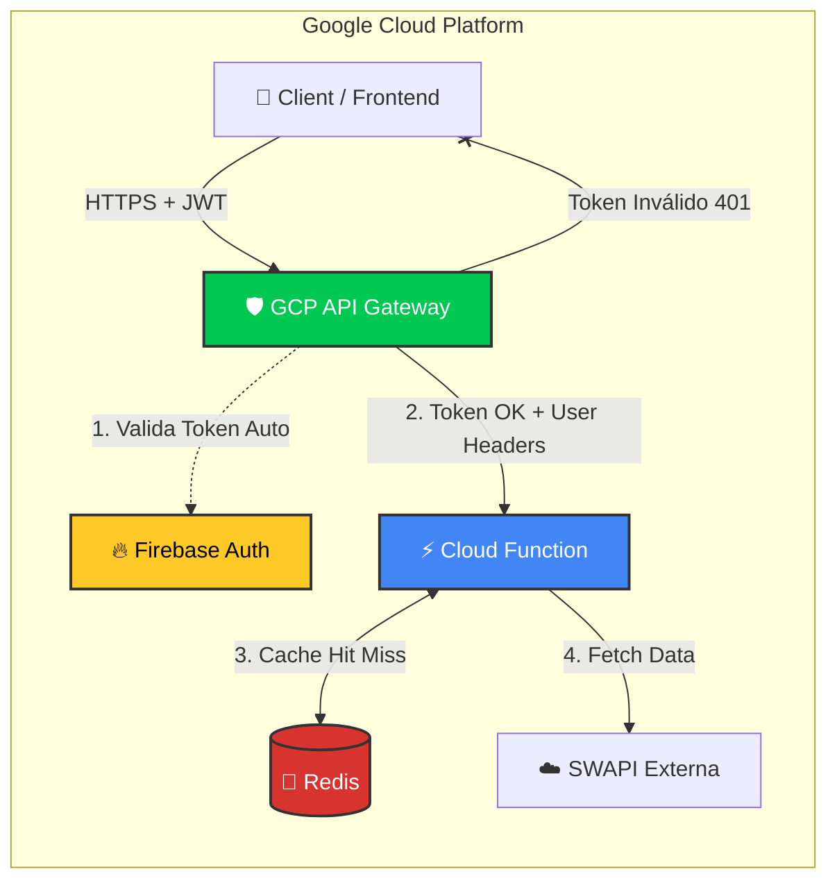
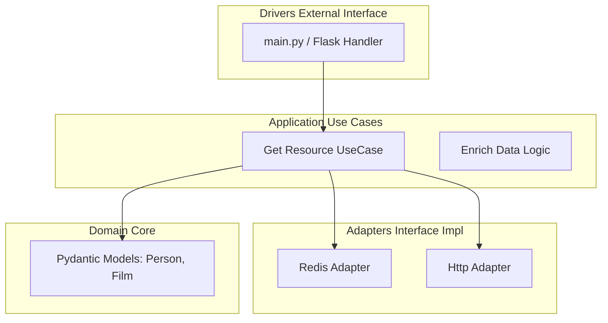
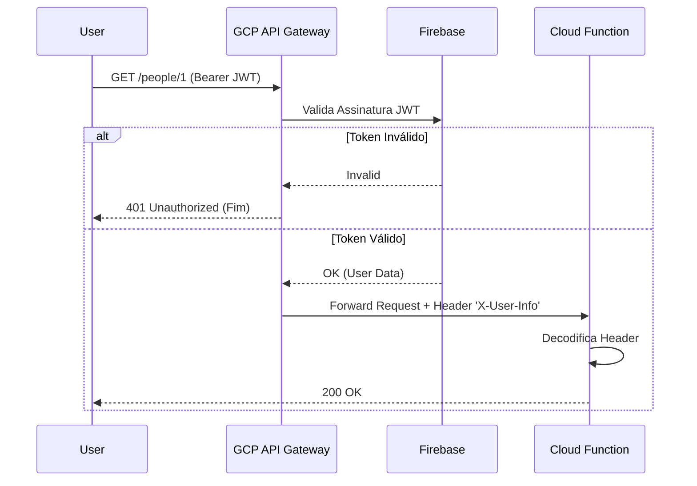
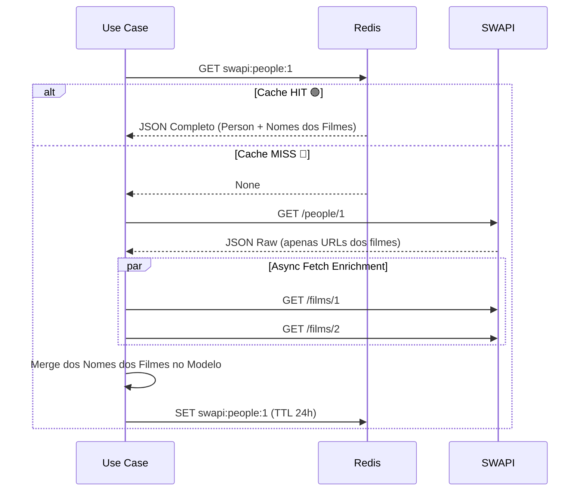

# 🏛️ Stellar Gateway - System Architecture Document

**Versão:** 1.1.0 (Final MVP)
**Data:** 30/01/2026

---

## 1. Visão Geral (Overview)

O **Stellar Gateway** é um middleware serverless de alta performance e segurança, projetado para atuar como um *Proxy Inteligente* sobre a API pública do Star Wars (SWAPI).

### 1.1 O Problema
A SWAPI é uma excelente fonte de dados, mas apresenta desafios para aplicações profissionais:
* **Latência e Confiabilidade:** Respostas lentas e sem SLA garantido.
* **Over-fetching/Under-fetching:** Dados relacionais (ex: filmes de um personagem) são retornados apenas como URLs, exigindo múltiplas requisições do frontend.
* **Segurança:** A API é pública, sem controle de quem acessa.

### 1.2 A Solução
Uma arquitetura em nuvem no **Google Cloud Platform (GCP)** que oferece:
1.  **Segurança em Camadas:** Autenticação via **Firebase** gerenciada pelo **GCP API Gateway** (Offloading).
2.  **Performance Extrema:** Estratégia de Cache-Aside com **Redis**.
3.  **Data Enrichment:** O backend "hidrata" dados automaticamente (busca nomes de filmes em paralelo) para entregar um JSON pronto ao frontend.

---

## 2. System Design (Infraestrutura)

A solução utiliza uma topologia **Serverless** moderna, onde a validação de segurança é delegada para a infraestrutura (Gateway), deixando a computação (Cloud Function) focada apenas em regras de negócio.


### 2.1 Componentes da Arquitetura
* **GCP API Gateway:** Ponto de entrada único. Responsável por roteamento, Rate Limiting e **Autenticação (Gatekeeper)**. Ele rejeita requisições inválidas antes que elas gerem custo computacional.
* **Google Cloud Functions:** Executa a lógica de negócio (Python). Recebe requisições já autenticadas.
* **Redis (Memorystore):** Cache de baixa latência. Utiliza conexão persistente (*Singleton Pool*) para suportar alta concorrência.
* **Firebase Auth:** Provedor de Identidade (IdP). Gerencia usuários e tokens OAuth (Google/Email).

---

## 3. Arquitetura de Software (Clean Architecture)

O microsserviço Python segue estritamente a **Arquitetura Hexagonal (Ports & Adapters)** para desacoplar a lógica de negócio das ferramentas externas.

### 3.1 Diagrama de Camadas



### 3.2 Segurança (Estratégia Híbrida)

A segurança adota uma abordagem de Defesa em Profundidade:

* **Produção (GCP API Gateway):** É a barreira principal. Rejeita tokens inválidos antes de invocar a função (economia de custo).
* **Desenvolvimento/Aplicação (Python Decorator):** Mantemos um decorator `@auth_required` no código.
    * **Motivo 1 (Dev):** Permite rodar e testar a API localmente (`flask run`) sem precisar subir um API Gateway na nuvem a cada mudança.
    * **Motivo 2 (Prod):** Atua como segunda camada de validação caso a configuração do Gateway falhe ou seja contornada acidentalmente (rotas públicas expostas).

### 3.3 Responsabilidades
| Camada | Diretório | Função |
| :--- | :--- | :--- |
| **Domain** | `src/domain` | Regras Universais. Define *como* um dado deve ser (`Person`). Ignora banco de dados e APIs. |
| **Use Cases** | `src/use_cases` | Orquestração. Define o fluxo: "Busque no Cache -> Se falhar, busque na API -> Enriqueça -> Salve". |
| **Adapters** | `src/adapters` | Tradutores. Sabem falar com o Redis (`set/get`) e com a SWAPI (`httpx`). |
| **Drivers** | `src/main.py` | Entrada. Lê headers injetados pelo Gateway, decodifica usuário e chama o Use Case. |

---

## 4. Fluxos de Dados (Sequence Diagrams)

### 4.1 Fluxo de Autenticação (Via Gateway)
Demonstra como o código Python é protegido pela infraestrutura.



### 4.2 Fluxo de Busca e Enriquecimento (Data Enrichment)
Demonstra a estratégia de performance para resolver o problema de "N+1 requests".


## 5. Decisões de Arquitetura (ADRs)

### ADR 001: API Gateway como Guardião
* **Decisão:** Mover a validação de JWT do código Python para o GCP API Gateway.
* **Motivo:** Redução de custos (evita *Cold Starts* em chamadas não autorizadas) e desacoplamento de responsabilidade. O código foca em negócio, a infra foca em segurança.

### ADR 002: Cache-Aside com TTL Fixo
* **Decisão:** Cachear respostas da SWAPI por 24 horas.
* **Motivo:** Dados de Star Wars são praticamente estáticos. O padrão Cache-Aside garante que o sistema se cure sozinho (self-healing) se o cache for limpo.

### ADR 003: Tratamento de Filtros (Smart Proxy)
* **Decisão:** Mapear filtros de domínio (`name`, `model`) para o parâmetro `search` da SWAPI. Rejeitar filtros não suportados (`eye_color`) com **400 Bad Request**.
* **Motivo:** Evitar a complexidade e lentidão de baixar todos os dados para filtrar em memória.

---

## 6. Especificação da API

**Base URL:** `https://[REGION]-[PROJECT].cloudfunctions.net/stellar-gateway/api/v1`

### Endpoints Principais

| Método | Rota | Descrição | Feature |
| :--- | :--- | :--- | :--- |
| `GET` | `/{resource}/{id}` | Busca recurso por ID | **Enrichment:** Hidrata campos correlacionados (ex.: filmes). |
| `GET` | `/{resource}/` | Lista paginada de recursos | **Search/Sorting:** Suporta filtros e ordenação. |
| `GET` | `/me` | Perfil do Usuário | Retorna dados do JWT (Google/Email). |

**Recursos suportados (`{resource}`):** `people`, `planets`, `starships`, `films`, `species`, `vehicles`.

**Parâmetros de consulta (lista):**
* `page`: paginação (repasse direto para a SWAPI).
* `search`: busca genérica (mapeada a partir de filtros de domínio).
* `sort_by`: ordenação em memória (ex.: `name`, `title`, `model`).

**Filtros de domínio (mapeados para `search`):**
* `people`: `name`
* `planets`: `name`
* `starships`: `name`, `model`
* `films`: `title`
* `species`: `name`
* `vehicles`: `name`, `model`

### Padrão de Resposta de Erro (RFC 7807)
```json
{
  "title": "Resource Not Found",
  "status": 404,
  "detail": "Person ID 99 does not exist.",
  "instance": "/people/99"
}
```

## 7. Estrutura de Pastas do Projeto

```text
.
├── src/
│   ├── adapters/          # Clientes HTTP (SWAPI) e Redis
│   ├── core/              # Configurações e Exceptions
│   ├── domain/            # Modelos de Dados (Pydantic)
│   ├── use_cases/         # Lógica de Negócio (Orquestração)
│   └── main.py            # Entrypoint (Lê headers do Gateway)
├── tests/                 # Testes Automatizados (Unitários/Integração)
├── scripts/               # Utilitários (Gerador de Token Dev)
├── openapi.yaml           # Configuração do GCP API Gateway
├── ARCHITECTURE.md        # Documentação de Arquitetura
├── TASKS.md               # Plano de Execução
└── pyproject.toml         # Dependências (Poetry)
```